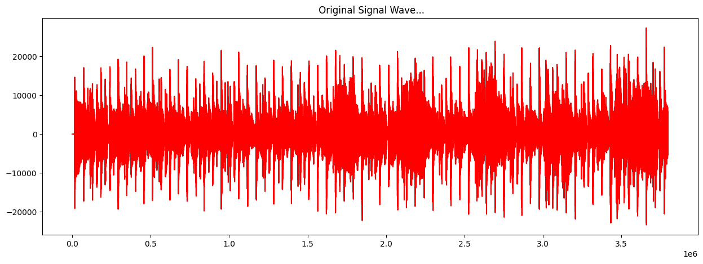
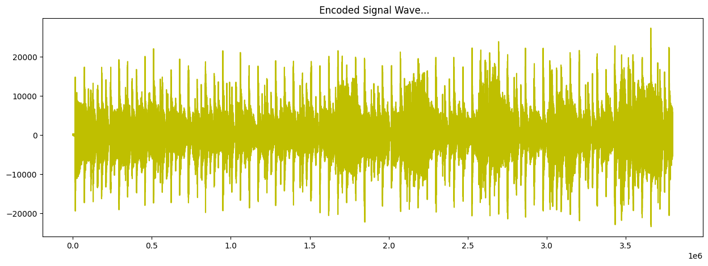
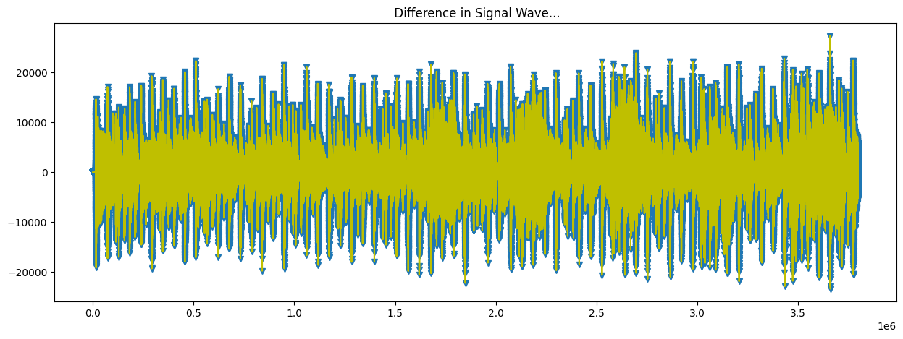

# AudioTracked
Audio steganography is a technique of hiding data within an audio file by modifying its properties in a way that the changes remain imperceptible to human ears. 

This project is a great way to hide multimodal files by concealing their bits in the least significant bit (LSB) of each sample in an audio file. Currently, it supports only mono audio files and does not have stereo support.

Below is the visualization of how the audio waveform appears after embedding an input in it.

This project has been evaluated using some of the finest, most pristine, and sonically exquisite audio compositions known to humankind. Thus Radiohead.

